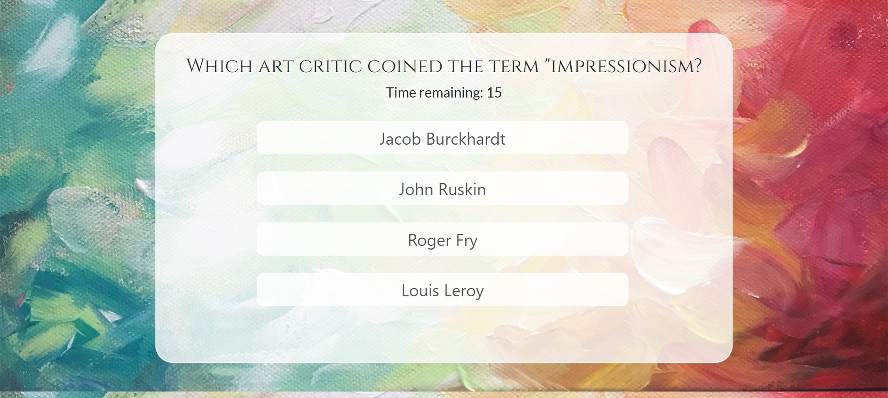
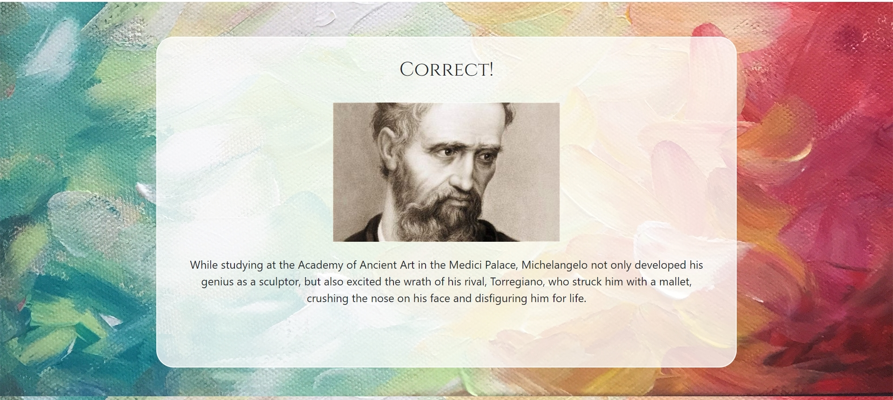

# TriviaGame

This is an Art Trivia Game. Technologies used are HTML, CSS, JavaScript, and JQuery.

Instructions
* There are a total of 10 questions.
* You will have 20 seconds to answer each question.
* After each question, you will be told whether you've answered correctly or incorrectly.
* Your score will be tallied up and displayed at the end.